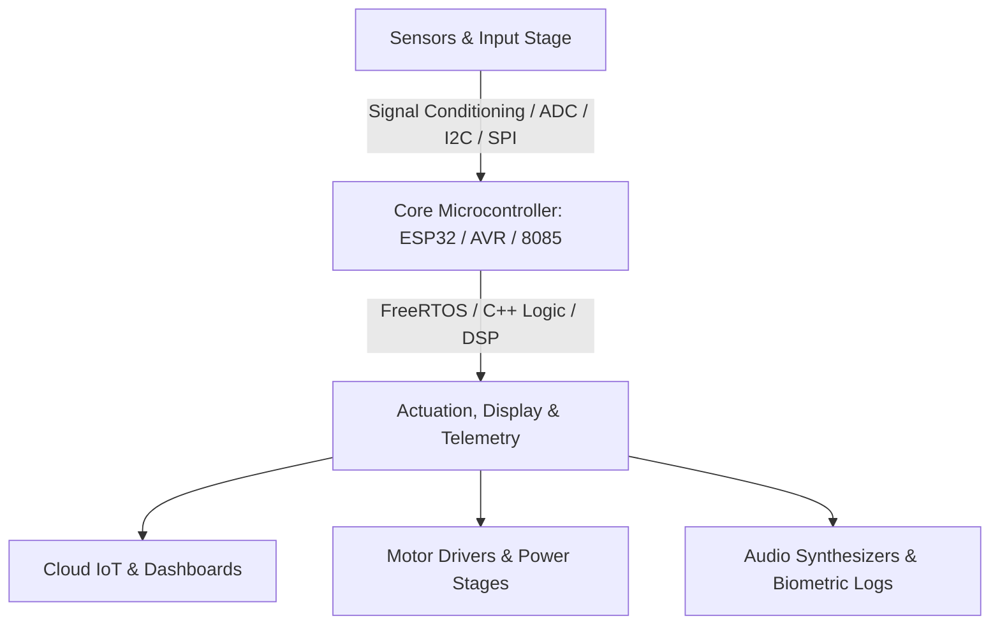

# ⚡ Abdelrahman Fathi Abodaif — Engineering Portfolio & Master CV

<p align="center">
  
</p>

<p align="center">
  <!-- Badges -->
  <a href="https://github.com/boOdybo/Portofolio"></a>
  <a href="https://github.com/boOdybo/Portofolio"></a>
  <a href="https://github.com/boOdybo/Portofolio/blob/main/LICENSE"></a>
  <a href="https://boOdybo.github.io/Portofolio/"></a>
  <a href="https://youtube.com/@MaLaZ00"></a>
  <a href="https://linkedin.com/in/abdelrahman-fathi3010/"></a>
</p>

<p align="center">
  <strong>🌐 Dual Language Support: English & العربية (Full RTL) | 🌓 Dark & Light Modes | 📟 Real-Time Signal HUD</strong>
</p>

---

## 📌 Table of Contents

- [Overview](#-overview)
- [Key Distinctions & Awards](#-key-distinctions--academic-honors)
- [Interactive Web App Features](#-interactive-web-app-features)
- [Featured Hardware & Embedded Projects](#-featured-hardware--embedded-projects)
- [Malaz Academy (@MaLaZ00)](#-malaz-academy--educational-impact)
- [TronicsHub Initiative](#-tronicshub--hardware-lab--prototyping)
- [Technical Skills Matrix](#-technical-skills-matrix)
- [Project Architecture & Directory Structure](#-project-architecture)
- [Quick Start & Local Setup](#-quick-start--local-development)
- [How to Deploy on GitHub Pages](#-github-pages-deployment-guide)
- [Customization Guide](#-customization-guide)
- [Contact & Connect](#-contact--connect)

---

## 👨‍💻 Overview

Welcome to the official **Interactive Engineering Portfolio & ATS Master CV Workstation** of **Abdelrahman Fathi Abodaif (Malaz)**.

I am an **Electronics & Embedded Systems Developer** and the founder of **TronicsHub**. Graduated **3rd in the Electronics Division (88% Honors)** from Sohag University, with a full **300/300 score** on my graduation project (*OptiNutri Scale*). I specialize in architecting end-to-end hardware solutions: from multi-layer custom PCB design in Altium Designer and low-level firmware engineering (C/C++, FreeRTOS, ESP32, Intel 8085 Assembly) to sensor telemetry, robotics, and applied higher mathematics.

Beyond engineering, I am passionate about knowledge transfer—having authored and published **262 in-depth university-level video lectures** on YouTube (*Malaz Academy*).

---

## 🏆 Key Distinctions & Academic Honors

| Honor / Award | Issuing Organization | Year | Highlights / Impact |
| :--- | :--- | :---: | :--- |
| **🥇 1st Place — Hult Prize (University Level)** | Hult Prize & Sohag University | **2024** | Ranked **#1** across all faculties; qualified to represent Sohag University at the **Regional Finals in Thailand**. |
| **🎖️ ISF — EGP Competition Winner** | Egyptian Innovators Support Fund (ISF) | **2024** | Sole winning team representing **Upper Egypt** under Egypt's Ministry of Higher Education & Scientific Research. |
| **🎖️ ISF — IGB Competition Winner** | Egyptian Innovators Support Fund (ISF) | **2024** | Awarded for industrial viability and scalable hardware architecture. |
| **🎓 88% Distinction with Honors (Ranked 3rd)** | Faculty of Technology & Education, Sohag Univ. | **2024** | **3rd** in Electronics Division, **10th** College-wide. |
| **💯 Full Score Graduation Project (300/300)** | Graduation Examination Board | **2024** | Awarded **100% full marks** with special jury commendation for *OptiNutri Scale*. |

---

## 🚀 Interactive Web App Features

This portfolio is not just a static showcase; it is a **fully interactive, high-performance web application** crafted with modern Vanilla CSS, Canvas API, and modular JavaScript:

### 1. 📟 Real-Time Virtual Oscilloscope & Signal HUD
- Real-time animated HTML5 Canvas simulator directly in the Hero section.
- Supports multi-protocol signal visualization: **UART (8N1)**, **I²C Data/Clock**, **SPI Bus**, **PWM Modulation**, and **Analog Sine Wave**.
- Dynamic telemetry readout updating frequency, logic voltage (3.3V/5V), and protocol status in real time.

### 2. 📄 Interactive Multi-Role ATS Master CV Workstation
- Tailor the CV layout in real time based on the target role:
  - 🔹 **Embedded Systems & IoT Developer**
  - 🔹 **Electronics & PCB Design Specialist**
  - 🔹 **Technical Trainer & Academic Instructor**
  - 🔹 **Comprehensive Master CV (All Projects & Evidence)**
- **One-Click Plaintext Copy**: Copies a clean, recruiter-friendly, ATS-formatted resume text to clipboard.
- **Print / Export ATS PDF**: Clean print stylesheets (`@media print`) optimized for standard A4 paper export.

### 3. 🌐 Full Bilingual Engine (English & Arabic with Native RTL)
- Seamless dynamic switching between **English (LTR)** and **العربية (RTL)** without page reloads.
- Responsive typography paired with **IBM Plex Sans Arabic** and **Inter / Space Grotesk**.

### 4. 🔍 Deep-Dive Project Explorer & Interactive Modals
- Filter projects by domain: *Embedded & IoT*, *Robotics & AI*, *Biometrics & Assistive Tech*, *Renewable Energy*.
- Click any project card to launch an architectural deep-dive modal featuring block diagrams, technical hardware specs, firmware stacks, and impact metrics.

### 5. 🌓 Adaptive Cyberpunk Dark & Crisp Light Modes
- Instant theme toggle backed by CSS Custom Properties (`--bg-app`, `--color-primary`, `--bg-card`).
- Persists user preferences seamlessly in `localStorage`.

---

## 🛠️ Featured Hardware & Embedded Projects



### 1. ⚖️ OptiNutri Scale — Connected Body Composition Platform *(Graduation Project: 300/300)*
- **Architecture**: `4x Load Cells + HX711 24-bit ADC` + `Ultrasonic Transceiver` + `BIA Sensors` ➔ `ESP32 Dual-Core (240MHz)` ➔ `WiFi Telemetry` ➔ `Cloud REST API` ➔ `Nutrition Dashboard`.
- **Highlights**: Engineered 24-bit ADC calibration routines, multi-channel bioelectrical impedance processing for fat estimation, and automated dynamic diet generation.

### 2. 🤖 AI Autonomous Mobile Robot with Voice Pipeline
- **Architecture**: `INMP441 I2S MEMS Mic` ➔ `Edge Audio DSP / STT` ➔ `Cloud LLM Reasoning` ➔ `TTS Synthesis` ➔ `MAX98357A I2S DAC` ➔ `Speaker Output` + `2D SLAM Obstacle Navigation`.
- **Highlights**: Real-time conversational agent running on ESP32-S3 with low-latency I2S digital audio pipeline and autonomous obstacle negotiation.

### 3. 🧤 Sign Language to Speech Assistive Smart Glove
- **Architecture**: `5x Resistive Flex Sensors` + `MPU6050 6-DOF IMU` ➔ `Microcontroller Gesture Classifier` ➔ `Voice Decoder` ➔ `Audio Output`.
- **Highlights**: Multi-sensor fusion with complementary filter for 3D hand orientation (yaw/pitch/roll) and rapid gesture-to-speech synthesis for mute/deaf communities.

### 4. 🦼 Multi-Mode Voice-Controlled Smart Wheelchair
- **Architecture**: `Voice Trigger Unit / Joystick` ➔ `Finite State Machine (FSM)` ➔ `High-Current H-Bridges` + `Ultrasonic 360° Safety Interlock Bubble`.
- **Highlights**: Dual-priority hardware interrupts immediately halt traction when obstacles breach proximity safety zones.

### 5. 💧 Industrial Desalination Telemetry & Monitoring System
- **Architecture**: `Analog TDS Probe` + `Hall-Effect Flow Meter` + `Temp Sensor` ➔ `ADC Filter Matrix` ➔ `Microcontroller Logger` ➔ `SPI MicroSD FAT32 CSV Engine`.
- **Highlights**: Temperature-compensated TDS calculation algorithm with multi-channel process variable logging.

### 6. 🧯 Autonomous Firefighting & Flame Triangulation Robot
- **Architecture**: `3-Way Optical IR Flame Sensor Array` + `IR Collision Matrix` ➔ `Microcontroller Logic` ➔ `H-Bridge Drivetrain` + `Relay-Driven Submersible Water Cannon`.

### 7. ☀️ Hybrid Solar Fruit Dryer with Closed-Loop Control
- **Architecture**: `Solar Thermal Collectors + 12V PV Panels` ➔ `DHT22 / DS18B20 Multi-Point Network` ➔ `Closed-Loop PID Controller` ➔ `Airflow Exhaust & Auxiliary Heaters`.

### 8. 🆔 Biometric Attendance Systems (Fingerprint & 13.56 MHz NFC)
- **Optical Fingerprint Scanner**: UART packet protocol, on-chip template store (100+ templates), RTC timestamping, EEPROM audit trail.
- **NFC Reader Unit**: Contactless 13.56 MHz RFID (ISO/IEC 14443 Type A), verification response in under 100ms.

---

## 🎓 Malaz Academy — Educational Impact

<p align="center">
  <a href="https://youtube.com/@MaLaZ00">
    
  </a>
  
  
</p>

Founded in December 2020, **Malaz (@MaLaZ00)** is a dedicated Arabic educational channel providing university-level lectures in engineering sciences and higher mathematics:

1. **📐 Higher Mathematics**: Differential & Integral Calculus, Ordinary Differential Equations (ODEs), Laplace & Inverse Laplace Transforms, Fourier Series, Gamma & Beta Special Functions.
2. **💻 Microprocessors & Assembly (Intel 8085)**: Internal Register Architecture, 8085 Instruction Sets (`MOV`, `MVI`, `LXI`, `LDA`, `STA`, `ADD`, `SUB`, `JMP`, `JZ`), Address Decoding, Memory Mapping, and Hardware Interrupts.
3. **⚡ Electric Circuits & Control Systems**: Kirchhoff's Laws, Thévenin/Norton Theorems, RLC Resonance, Block Diagram Reduction, Transfer Functions, Transient Response, and Routh-Hurwitz Stability.
4. **📊 Statistics, Physics & MATLAB**: Regression Analysis, Dispersion, Statics/Dynamics, and practical MATLAB simulation guides.

---

## 🔬 TronicsHub — Hardware Lab & Prototyping

**TronicsHub** is an independent hardware engineering initiative founded in October 2024 in Sohag, Egypt.

- 🛠️ **Custom Embedded Device Prototyping**: End-to-end realization from schematic concept to bench testing.
- 📐 **PCB Layout & DFM**: Schematic capture, multi-layer layout, power plane design, and Gerber exports in Altium Designer.
- 🎓 **Graduation Project Incubation**: Mentoring senior engineering students in system design, debugging, and jury defense.
- 👨‍🏫 **Hands-On Technical Training**: Practical workshops in microcontrollers, robotics, and applied mathematics.

---

## 💻 Technical Skills Matrix

```
┌───────────────────────────────────┐   ┌───────────────────────────────────┐
│     Embedded Systems & Firmware   │   │    Electronics & Hardware Design  │
├───────────────────────────────────┤   ├───────────────────────────────────┤
│ • ESP32 / ESP32-S3 (FreeRTOS)     │   │ • Analog & Digital Circuit Design │
│ • Embedded C / C++ & Registers    │   │ • Power MOSFET & Gate Drivers     │
│ • Protocols: I2C, SPI, UART, I2S  │   │ • Optoisolated Relay Switching    │
│ • Microchip AVR / Arduino         │   │ • High-Current H-Bridge Drivers   │
│ • Sensor Fusion & Telemetry       │   │ • Sensor Conditioning (BIA/ADC)   │
└───────────────────────────────────┘   └───────────────────────────────────┘
┌───────────────────────────────────┐   ┌───────────────────────────────────┐
│      PCB Design & Fabrication     │   │     Microprocessors & Assembly    │
├───────────────────────────────────┤   ├───────────────────────────────────┤
│ • Altium Designer (Schematic/PCB) │   │ • Intel 8085 CPU Architecture     │
│ • Multi-Layer Routing & DRC       │   │ • 8085 Assembly Programming       │
│ • Power Planes & Decoupling       │   │ • Memory & I/O Address Decoding   │
│ • Gerber, Drill & BOM Generation  │   │ • Hardware Interrupts & Flags     │
└───────────────────────────────────┘   └───────────────────────────────────┘
┌───────────────────────────────────┐   ┌───────────────────────────────────┐
│      Control Systems & Theory     │   │      Applied Higher Mathematics   │
├───────────────────────────────────┤   ├───────────────────────────────────┤
│ • Transfer Functions & Block Red. │   │ • Differential & Integral Calculus│
│ • Transient & Frequency Response  │   │ • Differential Equations (ODEs)   │
│ • Routh-Hurwitz Stability Criteria│   │ • Laplace & Fourier Transforms    │
│ • Mobile Robotics & SLAM          │   │ • Engineering Statistics & Physics│
└───────────────────────────────────┘   └───────────────────────────────────┘
```

---

## 📂 Project Architecture

```
Portofolio/
├── 📄 index.html               # Semantic HTML5 Application Shell & Layout
├── 📄 abdelrahman-portfolio.html# Standalone Single-File Variant
├── 📄 master.txt               # Master Curriculum Vitae Source Repository
├── 📄 README.md                # Comprehensive Project Documentation
│
├── 📂 css/
│   ├── 🎨 main.css             # Theme Design System (CSS Tokens, Sidebar & Typography)
│   ├── 🧩 components.css       # Cards, Buttons, Oscilloscope HUD, CV Workstation & Modals
│   └── 🌐 rtl.css              # Arabic Right-to-Left (RTL) Layout Adaptations
│
└── 📂 js/
    ├── ⚙️ app.js                # Core App Controller, DOM Renderer, Events & Modals
    ├── 📊 data.js               # Structured Data Store (Projects, Awards, Stats, Skills)
    ├── 🌐 i18n.js               # Bilingual Translation Dictionary (EN / AR)
    ├── 📄 cv-engine.js          # Interactive ATS Resume Generator & Export Engine
    └── 📟 oscilloscope.js       # Real-Time HTML5 Canvas Signal Monitor
```

---

## ⚡ Quick Start & Local Development

No package managers, build steps, or external bundlers required! The project runs directly in any modern web browser.

### Option 1: Direct Browser Launch
Simply clone the repository and open `index.html`:
```bash
git clone https://github.com/boOdybo/Portofolio.git
cd Portofolio
# Double click index.html or open via terminal:
start index.html   # On Windows
open index.html    # On macOS
xdg-open index.html # On Linux
```

### Option 2: Run with VS Code Live Server
1. Open the cloned folder in **VS Code**.
2. Install the extension: **Live Server** (`ritwickdey.LiveServer`).
3. Right-click `index.html` ➔ Select **"Open with Live Server"**.

### Option 3: Run with Python / Node.js
```bash
# Python 3
python -m http.server 3000

# Or Node.js (npx serve)
npx serve .
```
Visit `http://localhost:3000` in your browser.

---

## 🚀 GitHub Pages Deployment Guide

To host this portfolio online for free using **GitHub Pages**:

1. Go to your repository settings: [https://github.com/boOdybo/Portofolio/settings/pages](https://github.com/boOdybo/Portofolio/settings/pages)
2. Under **Build and deployment** ➔ **Source**, select **Deploy from a branch**.
3. Choose Branch: `main` (or `master`) and folder: `/ (root)`.
4. Click **Save**.
5. Your live portfolio will be available within seconds at:
   👉 **`https://boOdybo.github.io/Portofolio/`**

---

## 🛠️ Customization Guide

### Adding or Updating Projects
Open [`js/data.js`](file:///d:/Documents/Faculty%20of%20Technology%20&%20Education/super/CV%20&%20Portofolio/js/data.js) and add a new entry to `PORTFOLIO_DATA.projects`:
```javascript
{
  id: "my-new-project",
  title: {
    en: "Project Name in English",
    ar: "اسم المشروع بالعربية"
  },
  category: "embedded-iot", // embedded-iot | robotics-ai | biometrics | renewable
  tagline: { en: "Tagline", ar: "وصف موجز" },
  summary: { en: "Summary...", ar: "الملخص..." },
  architecture: "Sensor ➔ MCU ➔ Actuator",
  specs: [
    { label: { en: "MCU", ar: "المتحكم" }, value: "ESP32" }
  ],
  highlights: [
    { en: "Key feature accomplished", ar: "الإنجاز المحقق" }
  ],
  featured: true,
  badge: "IoT"
}
```

### Updating Translations or UI Text
Open [`js/i18n.js`](file:///d:/Documents/Faculty%20of%20Technology%20&%20Education/super/CV%20&%20Portofolio/js/i18n.js) and update or add the required translation keys.

---

## 📬 Contact & Connect

Feel free to connect for embedded systems opportunities, PCB design consultations, training engagements, or technical inquiries:

<p align="center">
  <a href="https://wa.me/201067572993" target="_blank">
    
  </a>
  <a href="mailto:abdelrahman.fathi.abodaif@gmail.com">
    
  </a>
  <a href="https://linkedin.com/in/abdelrahman-fathi3010/" target="_blank">
    
  </a>
  <a href="https://github.com/boOdybo" target="_blank">
    
  </a>
  <a href="https://youtube.com/@MaLaZ00" target="_blank">
    
  </a>
</p>

---

<p align="center">
  Designed &amp; Engineered with precision by <strong>Abdelrahman Fathi Abodaif</strong> &bull; © 2026 All Rights Reserved
</p>
